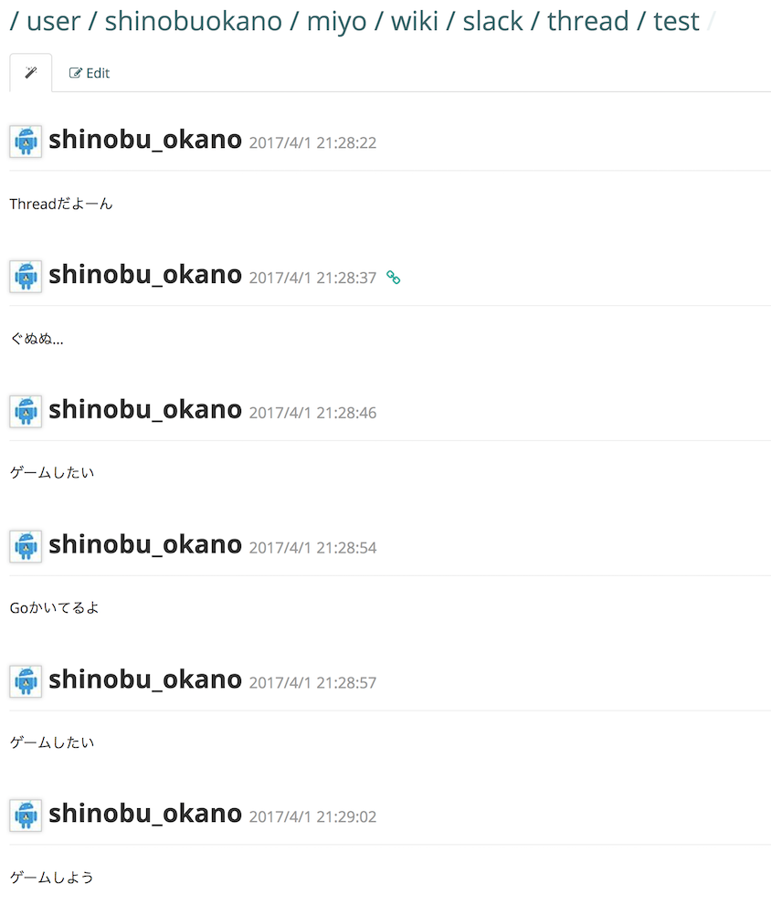

# miyo

Convert slack thread to crowi page.


## Installation

```bash
go get github.com/operando/miyo
```

## Run

```bash
miyo -cf config.toml -c channel -t thread_ts -p page_path
```

## Config File

```toml
slack_token = "" # your Slack token

[crowi]
api_url = "" # your crowi api url
token = "" # your crowi api token
```


## Output Image

| Slack Thread | Converted Crowi Page | 
|---|---|
|  |  |


### License

```
Apache Version 2.0

Copyright (C) 2017 Shinobu Okano

Licensed under the Apache License, Version 2.0 (the "License");
you may not use this file except in compliance with the License.
You may obtain a copy of the License at

   http://www.apache.org/licenses/LICENSE-2.0

Unless required by applicable law or agreed to in writing, software
distributed under the License is distributed on an "AS IS" BASIS,
WITHOUT WARRANTIES OR CONDITIONS OF ANY KIND, either express or implied.
See the License for the specific language governing permissions and
limitations under the License.
```
